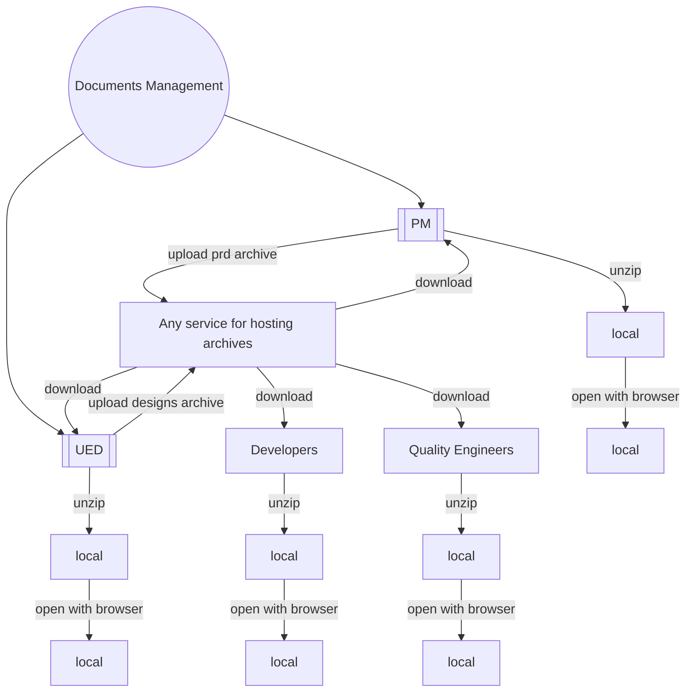
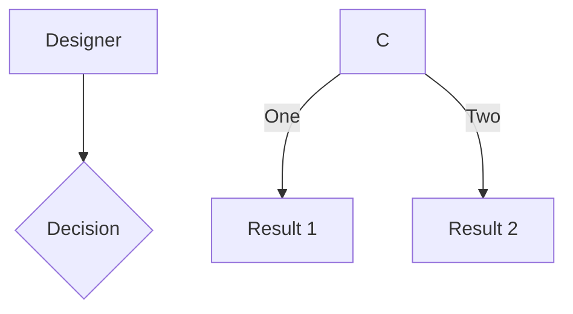

# I'm Q

<div class="pt-12">
  <span @click="$slidev.nav.next" class="px-2 py-1 rounded cursor-pointer" hover="bg-white bg-opacity-10">
    Press Space for next page <carbon:arrow-right class="inline"/>
  </span>
</div>

<div class="abs-br m-6 flex gap-2">
  <button @click="$slidev.nav.openInEditor()" title="Open in Editor" class="text-xl slidev-icon-btn opacity-50 !border-none !hover:text-white">
    <carbon:edit />
  </button>
  <a href="https://github.com/slidevjs/slidev" target="_blank" alt="GitHub"
    class="text-xl slidev-icon-btn opacity-50 !border-none !hover:text-white">
    <carbon-logo-github />
  </a>
</div>

<!--
The last comment block of each slide will be treated as slide notes. It will be visible and editable in Presenter Mode along with the slide. [Read more in the docs](https://sli.dev/guide/syntax.html#notes)
-->

---
transition: fade-out
---

# Who am I
A front-end engineer without a plaid shirt, resolutely without wigs, full of curiosity！


- 👋 Hi, I’m [Github/zhouLion](https://github.com/zhouLion) from Hunan🌶️，and I'm working in Shenzhen
- 👀 I’m interested in front-end development and reading book
- 💞️ I'm looking for a passionate ⚡️, open 💥 and innovative 🧠 team to work with
- 🌱 I’m currently learning 🍳cooking, 🌳potting and 🇬🇧english
- 📫 How to reach me 🫱 <a href="mailto:zhouquan147369@gmail.com">Gmail</a> | <a href="https://twitter.com/zhouqua66139304" target="_blank">Twitter</a> 🫲
/zhouLion/learning-visualizer/blob/main/diagram.svg
<!--
You can have `style` tag in markdown to override the style for the current page.
Learn more: https://sli.dev/guide/syntax#embedded-styles
-->

<style>
h1 {
  background-color: #2B90B6;
  background-image: linear-gradient(45deg, #4EC5D4 10%, #146b8c 20%);
  background-size: 100%;
  -webkit-background-clip: text;
  -moz-background-clip: text;
  -webkit-text-fill-color: transparent;
  -moz-text-fill-color: transparent;
}
</style>

---
transition: slide-up
layout: cover
background: /projects.svg
---
# Projects

<div v-click>
  <span>In 2016 I was graduated as GIS engineer </span>
  <br>
  <logos-jquery class="icon"/>
  <logos-bootstrap class="icon"/>
  <logos-openlayers class="icon"/>
  <logos-d3 class="icon"/>
  <logos-require class="icon"/>
</div>

  
<div class="my-2" v-click>
  <span>In 2017 the storm of the front-end reached Hefei, where I am located. </span>
  <br>
  <logos-nodejs class="icon"/>
  <logos-browserify class="icon"/>
  <logos-vue class="icon"/>
  <logos-gulp class="icon"/>
  <logos-express class="icon"/>
  <logos-mongodb class="icon"/>
</div>


<div class="my-2" v-click>
  <span>Since then, I've followed the evolution of the <logos-vue class="text-sm!"/> ecosystem </span>
  
  <br>
  <logos-jest class="icon"/>
  <logos-storybook class="icon"/>
  <logos-eslint class="icon"/>
  <logos-webpack class="icon"/>
  <logos-element class="icon"/>
  <logos-vitejs class="icon"/>
  <logos-nuxt class="icon"/>
  <logos-vitest class="icon"/>
  <logos-vueuse class="icon"/>
  <logos-windi-css class="icon"/>
  <logos-unocss class="icon"/>
  <span class="text-2lg">...</span>
</div>

<style>
.icon {
  @apply text-5xl bg-light-50 m-2 p-2 rounded-1 p-1 relative
}
</style>
<!--
Here is another comment.

得益于大学和第一份工作所学，我是一名 GIS 老手
Thanks to what I learned in college and my first job, I'm a GIS veteran

对项目不挑食，身经百战使我能驾驭 PC端、移动端、小程序的项目开发
I am not a picky eater for projects, and 
my experience in a hundred battles allows me 
to control the project development of PC, mobile, and mini programs
-->

---
transition: slide-up
layout: iframe-right
url: https://htmlpreview.github.io/?https://github.com/zserge/awfice/blob/main/calculator.html
---

# Project0: awfice
the world smallest office suite
- **My first** pull request on Github
- Implement the most basic web tools with extremely simple code
- For example:
> A simple calculator which supports the basic operational symbol to calculate.

```html
data:text/html,<table style="text-align: center;width:80vw;margin: 0 auto;"><tbody><tr><td colspan="4"><textarea></textarea></td></tr></tbody><script>let d=document;let tbl=d.querySelector('tbody');let z=d.querySelector('textarea');let oc=(x)=>z.value+=x;let cl=()=>z.value='';let re=()=>{try{z.value=eval(z.value);}catch(error){cl();}};[[1,2,3,'+'],[4,5,6,'-'],[7,8,9,'*'],['C',0,'=','/']].forEach((a)=>{let r=d.createElement('tr');r.style.lineHeight='64px';tbl.appendChild(r);a.forEach((b)=>{let tb=d.createElement('tb');tb.innerText=b;tb.style.padding='16px';tb.style.border='1px solid';r.appendChild(tb);tb.onclick=b==='='?re:b==='C'?cl:()=>oc(b);})})</script></table>
```

[Try or preview it on the right😊](https://htmlpreview.github.io/?https://github.com/zserge/awfice/blob/main/calculator.html)

---
transition: slide-up
layout: iframe-right
url: https://robot.medcaastest.city.pingan.com/qa/triage_diagnosis
---

# project1: triage diagnosis


---

# Project1: nodepage
A system that automatically publishes product prototypes and UI designs as online web pages

<div class="flex justify-around">



</div>
---
layout: iframe-right
url: https://zhoulion.github.io/learning-visualizer/#/
---
# Project2: learning-visualizer
Just play and try to explore data visualizations

The visualizer techniques that I'm learning
- [x]  Canvas - Basic computer web drawing API
- [ ]  SVG - Define images using XML tags 
- [x]  ThreeJS - Escape from lengthy 😥WebGL APIs and embrace 😆Threejs
- [ ]  D3.js - I use D3 while there is a 2D chart that cannot be achieved with echarts
- [x]  Openlayers - This library makes it easy for me to draw web maps

[Click here](https://www.npmjs.com/package/nodepage)
