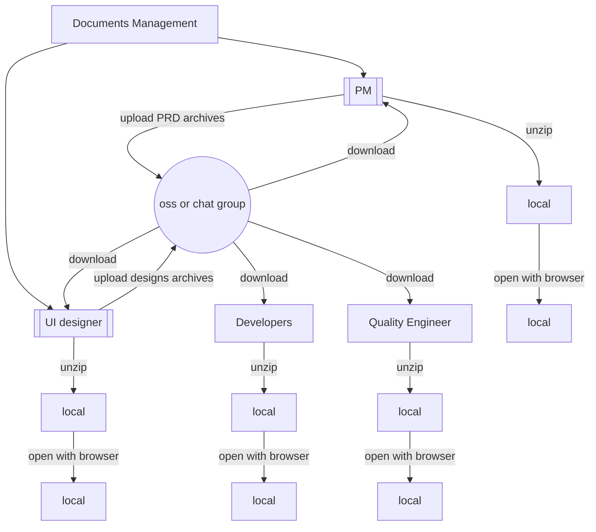
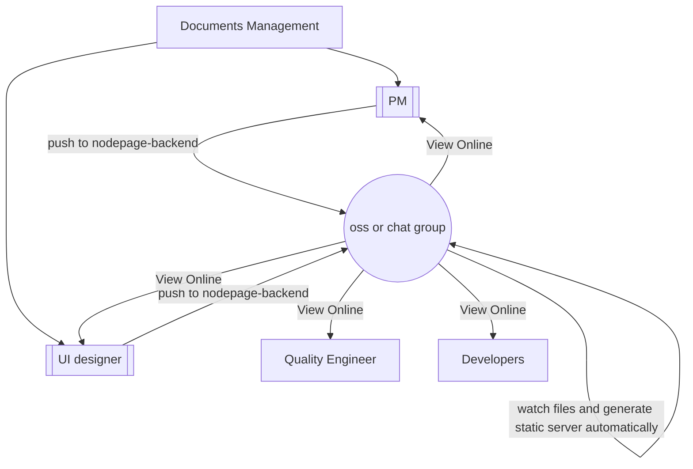

# I'm Q

<div class="pt-12">
  <span @click="$slidev.nav.next" class="px-2 py-1 rounded cursor-pointer" hover="bg-white bg-opacity-10">
    Press Space for next page <carbon:arrow-right class="inline"/>
  </span>
</div>

<div class="abs-br m-6 flex gap-2">
  <button @click="$slidev.nav.openInEditor()" title="Open in Editor" class="text-xl slidev-icon-btn opacity-50 !border-none !hover:text-white">
    <carbon:edit />
  </button>
  <a href="https://github.com/slidevjs/slidev" target="_blank" alt="GitHub"
    class="text-xl slidev-icon-btn opacity-50 !border-none !hover:text-white">
    <carbon-logo-github />
  </a>
</div>

<!--
The last comment block of each slide will be treated as slide notes. It will be visible and editable in Presenter Mode along with the slide. [Read more in the docs](https://sli.dev/guide/syntax.html#notes)
-->

---
transition: fade-out
---

# Who am I
A front-end engineer without a plaid shirt, resolutely without wigs, full of curiosity！


- 👋 Hi, I’m [Github/zhouLion](https://github.com/zhouLion) from Hunan🌶️，and I'm working in Shenzhen
- 👀 I’m interested in front-end development and reading book
- 💞️ I'm looking for a passionate ⚡️, open 💥 and innovative 🧠 team to work with
- 🌱 I’m currently learning 🍳cooking, 🌳potting and 🇬🇧english
- 📫 How to reach me 🫱 <a href="mailto:zhouquan147369@gmail.com">Gmail</a> | <a href="https://twitter.com/zhouqua66139304" target="_blank">Twitter</a> 🫲

<!--
You can have `style` tag in markdown to override the style for the current page.
Learn more: https://sli.dev/guide/syntax#embedded-styles
-->

<style>
h1 {
  background-color: #2B90B6;
  background-image: linear-gradient(45deg, #4EC5D4 10%, #146b8c 20%);
  background-size: 100%;
  -webkit-background-clip: text;
  -moz-background-clip: text;
  -webkit-text-fill-color: transparent;
  -moz-text-fill-color: transparent;
}
</style>

---
transition: slide-up
layout: cover
background: /projects.svg
---

# Projects

<div v-click>
  <span>In 2016 I graduated as GIS engineer </span>
  <br>
  <a href="https://jquery.com"><logos-jquery class="icon"/></a>
  <logos-bootstrap class="icon"/>
  <a href="https://openlayers.org/"><logos-openlayers class="icon"/></a>
  <a href="https://d3js.org/"><logos-d3 class="icon"/></a>
  <logos-require class="icon"/>
</div>

  
<div class="my-2" v-click>
  <span>In 2017 a wave of change sweeps the front-end </span>
  <br>
  <logos-nodejs class="icon"/>
  <logos-browserify class="icon"/>
  <logos-vue class="icon"/>
  <logos-gulp class="icon"/>
  <logos-express class="icon"/>
  <logos-mongodb class="icon"/>
</div>


<div class="my-2" v-click>
  <span>Since then, I've followed the evolution of the <logos-vue class="text-sm"/> ecosystem </span>
  
  <br>
  <logos-jest class="icon"/>
  <logos-storybook class="icon"/>
  <logos-eslint class="icon"/>
  <logos-webpack class="icon"/>
  <logos-element class="icon"/>
  <logos-vitejs class="icon"/>
  <logos-nuxt class="icon"/>
  <a href="https://vitest.dev/"><logos-vitest class="icon"/></a>
  <logos-vueuse class="icon"/>
  <logos-windi-css class="icon"/>
  <logos-unocss class="icon"/>
  <span class="text-2lg">...</span>
</div>

<style>
.icon {
  @apply text-5xl bg-light-50 m-2 p-2 rounded-1 p-1 relative
}
</style>

<!--
Here is another comment.

Thanks to what I learned in college and my first job, I'm a GIS veteran

I am not a picky eater for projects, and 
my experience in so many projects which allows me 
to control the project development of PC, mobile, and mini programs
-->

---

# Screenshots of Company Projects


<script setup>
const images = [
  ['H5','/image.jpg'],
  ['H5','/image1.jpg'],
  ['PC','https://user-images.githubusercontent.com/19882767/219876338-5fc67c20-b337-460c-86c9-ae3186369cf1.png'],
  ['PC','https://user-images.githubusercontent.com/19882767/219264036-4d9abcc2-d4ca-46ed-aa57-701da86697f9.png'],
  ['PC','https://user-images.githubusercontent.com/19882767/219265576-a961bd6e-6ac3-4682-ae6b-ca503837761a.png'],
  ['PC','https://user-images.githubusercontent.com/19882767/219875148-82456e43-39fe-4c88-a516-83497c21f3b5.png'],
  ['PC','https://user-images.githubusercontent.com/19882767/219875429-1f0be6fe-7fca-4aac-adbe-7595d49a0f59.png'],
  ['PC','https://user-images.githubusercontent.com/19882767/219876815-2a673c71-14cf-407f-8492-ff5d1c85607c.png'],
]

const calcStyle = (type, i) => {
  const layoutH = document.querySelector('#slide-content').clientHeight
  const iphoneWH = [390, 844]
  const pcWH = [1920, 1080]
  if (type === 'PC') {
    return {
      width: `${layoutH * pcWH[0]/pcWH[1]})px`,
      height: layoutH + 'px',
      zIndex: i + 1
    }
  } else if (type === 'H5') {
    return {
      width: `${layoutH * iphoneWH[0]/iphoneWH[1]})px`,
      height: layoutH + 'px',
      zIndex: i + 1
    }
  }
}
</script>

<style>
.center-v {
  position: absolute;
  top: 50%;
  left: 50%;
  transform: translate(-50%, -50%);
}
</style>

---
layout: two-cols
---

# Project0: awfice
the world smallest office suite
- **My first** pull request on Github
- Implement the most basic web tools with extremely simple code
- For example:
> A simple calculator which supports the basic operational symbol to calculate.

```html
data:text/html,<table style="text-align: center;width:80vw;margin: 0 auto;"><tbody><tr><td colspan="4"><textarea></textarea></td></tr></tbody><script>let d=document;let tbl=d.querySelector('tbody');let z=d.querySelector('textarea');let oc=(x)=>z.value+=x;let cl=()=>z.value='';let re=()=>{try{z.value=eval(z.value);}catch(error){cl();}};[[1,2,3,'+'],[4,5,6,'-'],[7,8,9,'*'],['C',0,'=','/']].forEach((a)=>{let r=d.createElement('tr');r.style.lineHeight='64px';tbl.appendChild(r);a.forEach((b)=>{let tb=d.createElement('tb');tb.innerText=b;tb.style.padding='16px';tb.style.border='1px solid';r.appendChild(tb);tb.onclick=b==='='?re:b==='C'?cl:()=>oc(b);})})</script></table>
```

::right::

<iframe src="data:text/html,%3Ctable%20style=%22text-align:%20center;width:80vw;margin:%200%20auto;%22%3E%3Ctbody%3E%3Ctr%3E%3Ctd%20colspan=%224%22%3E%3Ctextarea%3E%3C/textarea%3E%3C/td%3E%3C/tr%3E%3C/tbody%3E%3Cscript%3Elet%20d=document;let%20tbl=d.querySelector('tbody');let%20z=d.querySelector('textarea');let%20oc=(x)=%3Ez.value+=x;let%20cl=()=%3Ez.value='';let%20re=()=%3E%7Btry%7Bz.value=eval(z.value);%7Dcatch(error)%7Bcl();%7D%7D;%5B%5B1,2,3,'+'%5D,%5B4,5,6,'-'%5D,%5B7,8,9,'*'%5D,%5B'C',0,'=','/'%5D%5D.forEach((a)=%3E%7Blet%20r=d.createElement('tr');r.style.lineHeight='64px';tbl.appendChild(r);a.forEach((b)=%3E%7Blet%20tb=d.createElement('tb');tb.innerText=b;tb.style.padding='16px';tb.style.border='1px%20solid';r.appendChild(tb);tb.onclick=b==='='?re:b==='C'?cl:()=%3Eoc(b);%7D)%7D)%3C/script%3E%3C/table%3E" height="400px" width="100%"></iframe>

<!--
w哦
https://github.com/zserge/awfice/pull/35
-->

---
transition: slide-up
layout: iframe-right
url: https://robot.medcaastest.city.pingan.com/qa/triage_diagnosis
---

# project1: AI diagnosis Q&A
A small web app docking AI diagnostic question and answer pair.

- Powered by + <logos-vitejs class="logo-icon"/> + <logos-vue class="logo-icon" />
- Screen-friendly 🖥️ 📲, progressive web app<logos-pwa class="logo-icon"/> 
- Implemented an input method for `pinyin` myself～

<style>
.logo-icon {
  @apply text-2xl bg-light-300 rounded p-1;
}
</style>

---
layout: cover
---

# Project2: nodepage
A system that automatically publishes product prototypes and UI designs as online web pages


---
layout: two-cols
---

# Traditional document management

## Background
For information security reasons, 

the Group's PRD and UI drafts are only allowed to be circulated on the intranet, 

and this makes communication difficult.

The diagram on the right illustrates this process 🫱

::right::



---
layout: two-cols
---
# How does nodepage handle it?

So I wrote a program to simplify the process

- Powered by <logos-vue class="logo-icon" /> + <logos-nodejs class="logo-icon" /> + <logos-git class="logo-icon" /> + <logos-koa class="logo-icon" />
- Core idea: `PRD and UI drafts` -- git push to server --> `server` -- Resolve directories and generate static service links --> `Client` --（Use the links to browse the file contents）--END

Show more on <a href="https://www.npmjs.com/package/nodepage" target="_blank"><logos-npm class="logo-icon" /> package/nodepage </a>

::right::


<style>
.logo-icon {
  @apply text-2xl bg-light-300 rounded p-1;
}
</style>

---
layout: iframe-right
url: https://zhoulion.github.io/learning-visualizer/#/
---

# Project3: learning-visualizer
Just play and try to explore data visualizations

The visualizer techniques that I'm learning
- [x]  Canvas - Basic computer web drawing API
- [x]  ThreeJS - 😢 Lengthy WebGL APIs => 👍 Embrace Threejs
- [x]  Openlayers - This library makes it easy for me to draw web maps
- [x]  SVG - Define images using XML tags 
- [x]  D3.js - I use D3 while there is a 2D chart that cannot be achieved with echarts

[Click here](https://www.npmjs.com/package/nodepage)
